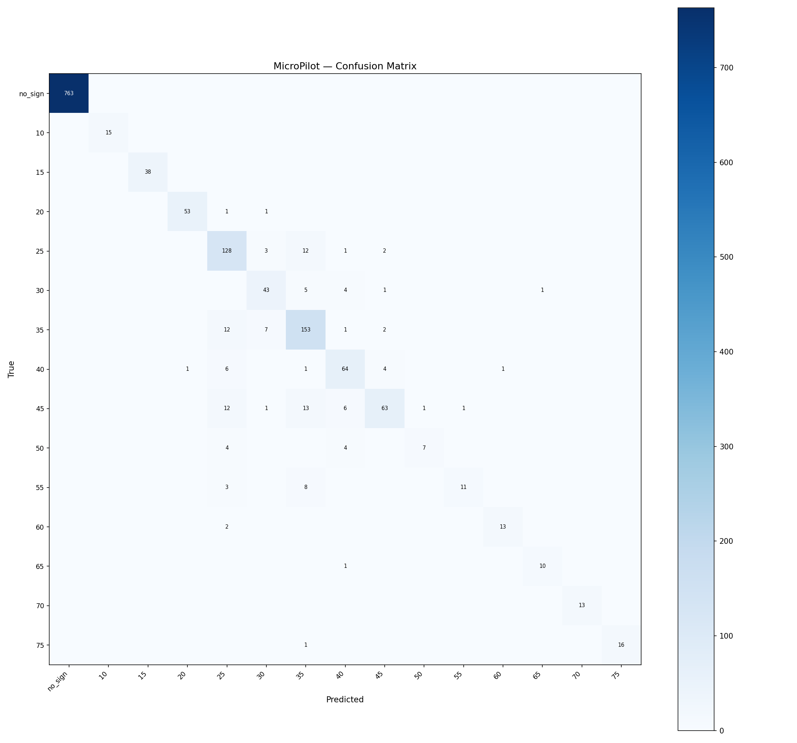

# MicroPilot Evaluation — lora_run1

**Tag:** `lora_run1`  
**LoRA adapter:** `models/minimind-o-lora`  
**Eval samples:** 1513 / 7566 total (held-out 20%, seed=42)  

## Summary

| Metric | Value |
|---|---|
| Accuracy | 0.919 (1390/1513) |
| Macro F1 | 0.866 |
| Weighted F1 | 0.917 |

## Per-Class Metrics

| Class | Precision | Recall | F1 | Support |
|---|---|---|---|---|
| no_sign | 1.000 | 1.000 | 1.000 | 763 |
| speed_limit_10 | 1.000 | 1.000 | 1.000 | 15 |
| speed_limit_15 | 1.000 | 1.000 | 1.000 | 38 |
| speed_limit_20 | 0.981 | 0.964 | 0.972 | 55 |
| speed_limit_25 | 0.762 | 0.877 | 0.815 | 146 |
| speed_limit_30 | 0.782 | 0.796 | 0.789 | 54 |
| speed_limit_35 | 0.793 | 0.874 | 0.832 | 175 |
| speed_limit_40 | 0.790 | 0.831 | 0.810 | 77 |
| speed_limit_45 | 0.875 | 0.649 | 0.746 | 97 |
| speed_limit_50 | 0.875 | 0.467 | 0.609 | 15 |
| speed_limit_55 | 0.917 | 0.500 | 0.647 | 22 |
| speed_limit_60 | 0.929 | 0.867 | 0.897 | 15 |
| speed_limit_65 | 0.909 | 0.909 | 0.909 | 11 |
| speed_limit_70 | 1.000 | 1.000 | 1.000 | 13 |
| speed_limit_75 | 1.000 | 0.941 | 0.970 | 17 |

