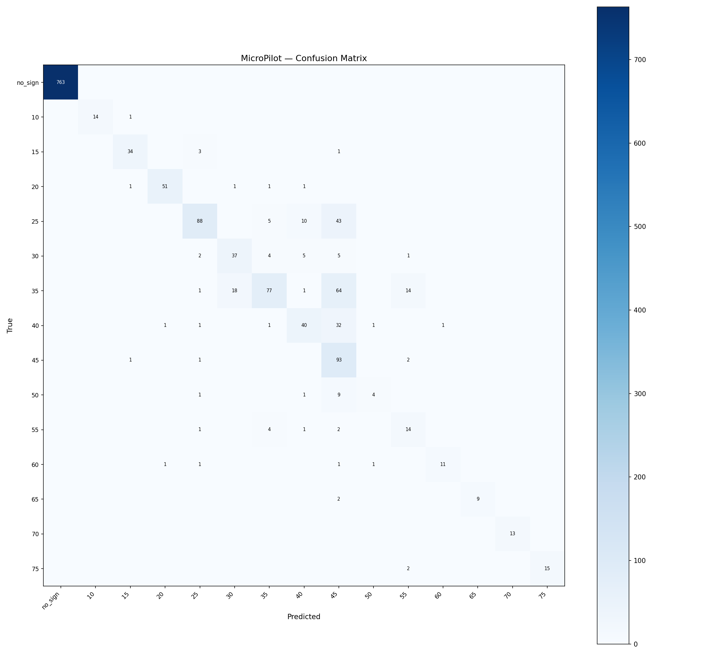

# MicroPilot Evaluation — lora_run2

**Tag:** `lora_run2`  
**LoRA adapter:** `models/minimind-o-lora-run2`  
**Eval samples:** 1513 / 7566 total (held-out 20%, seed=42)  

## Summary

| Metric | Value |
|---|---|
| Accuracy | 0.835 (1263/1513) |
| Macro F1 | 0.763 |
| Weighted F1 | 0.840 |

## Per-Class Metrics

| Class | Precision | Recall | F1 | Support |
|---|---|---|---|---|
| no_sign | 1.000 | 1.000 | 1.000 | 763 |
| speed_limit_10 | 1.000 | 0.933 | 0.966 | 15 |
| speed_limit_15 | 0.919 | 0.895 | 0.907 | 38 |
| speed_limit_20 | 0.962 | 0.927 | 0.944 | 55 |
| speed_limit_25 | 0.889 | 0.603 | 0.718 | 146 |
| speed_limit_30 | 0.661 | 0.685 | 0.673 | 54 |
| speed_limit_35 | 0.837 | 0.440 | 0.577 | 175 |
| speed_limit_40 | 0.678 | 0.519 | 0.588 | 77 |
| speed_limit_45 | 0.369 | 0.959 | 0.533 | 97 |
| speed_limit_50 | 0.667 | 0.267 | 0.381 | 15 |
| speed_limit_55 | 0.424 | 0.636 | 0.509 | 22 |
| speed_limit_60 | 0.917 | 0.733 | 0.815 | 15 |
| speed_limit_65 | 1.000 | 0.818 | 0.900 | 11 |
| speed_limit_70 | 1.000 | 1.000 | 1.000 | 13 |
| speed_limit_75 | 1.000 | 0.882 | 0.938 | 17 |

