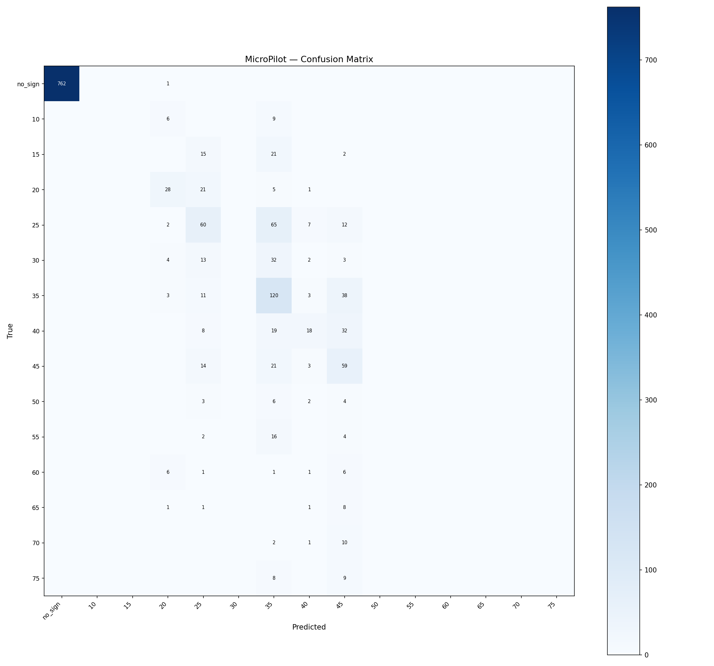

# MicroPilot Evaluation — lora_run3

**Tag:** `lora_run3`  
**LoRA adapter:** `models/minimind-o-lora-run3`  
**Eval samples:** 1513 / 7566 total (held-out 20%, seed=42)  

## Summary

| Metric | Value |
|---|---|
| Accuracy | 0.692 (1047/1513) |
| Macro F1 | 0.209 |
| Weighted F1 | 0.660 |

## Per-Class Metrics

| Class | Precision | Recall | F1 | Support |
|---|---|---|---|---|
| no_sign | 1.000 | 0.999 | 0.999 | 763 |
| speed_limit_10 | 0.000 | 0.000 | 0.000 | 15 |
| speed_limit_15 | 0.000 | 0.000 | 0.000 | 38 |
| speed_limit_20 | 0.549 | 0.509 | 0.528 | 55 |
| speed_limit_25 | 0.403 | 0.411 | 0.407 | 146 |
| speed_limit_30 | 0.000 | 0.000 | 0.000 | 54 |
| speed_limit_35 | 0.369 | 0.686 | 0.480 | 175 |
| speed_limit_40 | 0.462 | 0.234 | 0.310 | 77 |
| speed_limit_45 | 0.316 | 0.608 | 0.415 | 97 |
| speed_limit_50 | 0.000 | 0.000 | 0.000 | 15 |
| speed_limit_55 | 0.000 | 0.000 | 0.000 | 22 |
| speed_limit_60 | 0.000 | 0.000 | 0.000 | 15 |
| speed_limit_65 | 0.000 | 0.000 | 0.000 | 11 |
| speed_limit_70 | 0.000 | 0.000 | 0.000 | 13 |
| speed_limit_75 | 0.000 | 0.000 | 0.000 | 17 |

