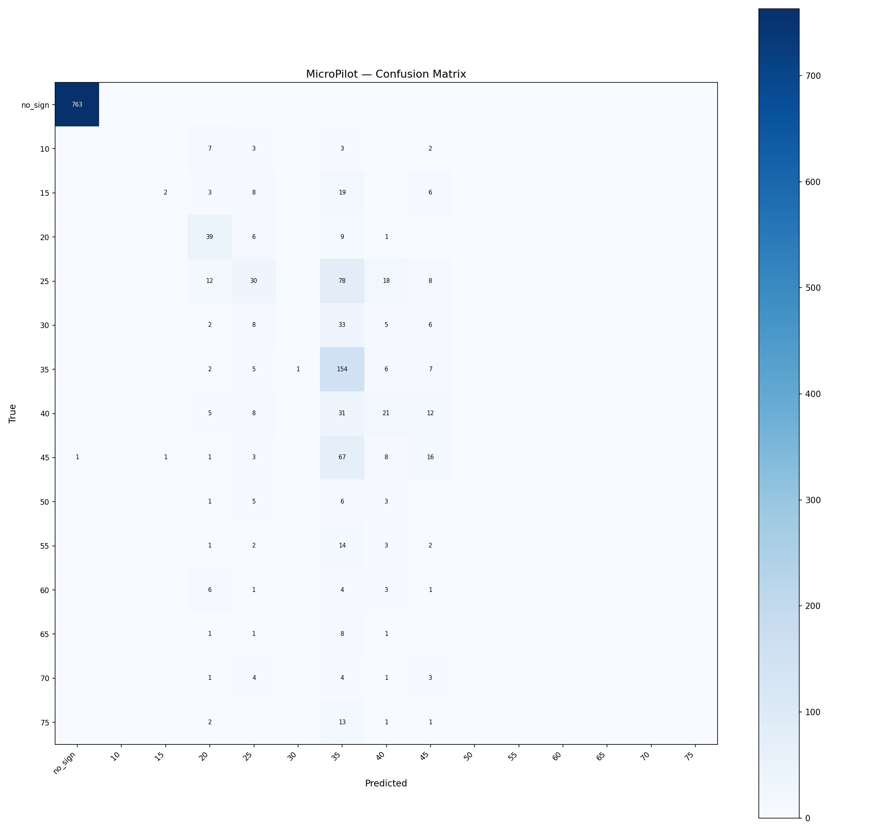

# MicroPilot Evaluation — lora_run4

**Tag:** `lora_run4`  
**LoRA adapter:** `models/minimind-o-lora-run4`  
**Eval samples:** 1513 / 7566 total (held-out 20%, seed=42)  

## Summary

| Metric | Value |
|---|---|
| Accuracy | 0.677 (1025/1513) |
| Macro F1 | 0.194 |
| Weighted F1 | 0.637 |

## Per-Class Metrics

| Class | Precision | Recall | F1 | Support |
|---|---|---|---|---|
| no_sign | 0.999 | 1.000 | 0.999 | 763 |
| speed_limit_10 | 0.000 | 0.000 | 0.000 | 15 |
| speed_limit_15 | 0.667 | 0.053 | 0.098 | 38 |
| speed_limit_20 | 0.470 | 0.709 | 0.565 | 55 |
| speed_limit_25 | 0.357 | 0.205 | 0.261 | 146 |
| speed_limit_30 | 0.000 | 0.000 | 0.000 | 54 |
| speed_limit_35 | 0.348 | 0.880 | 0.498 | 175 |
| speed_limit_40 | 0.296 | 0.273 | 0.284 | 77 |
| speed_limit_45 | 0.250 | 0.165 | 0.199 | 97 |
| speed_limit_50 | 0.000 | 0.000 | 0.000 | 15 |
| speed_limit_55 | 0.000 | 0.000 | 0.000 | 22 |
| speed_limit_60 | 0.000 | 0.000 | 0.000 | 15 |
| speed_limit_65 | 0.000 | 0.000 | 0.000 | 11 |
| speed_limit_70 | 0.000 | 0.000 | 0.000 | 13 |
| speed_limit_75 | 0.000 | 0.000 | 0.000 | 17 |

