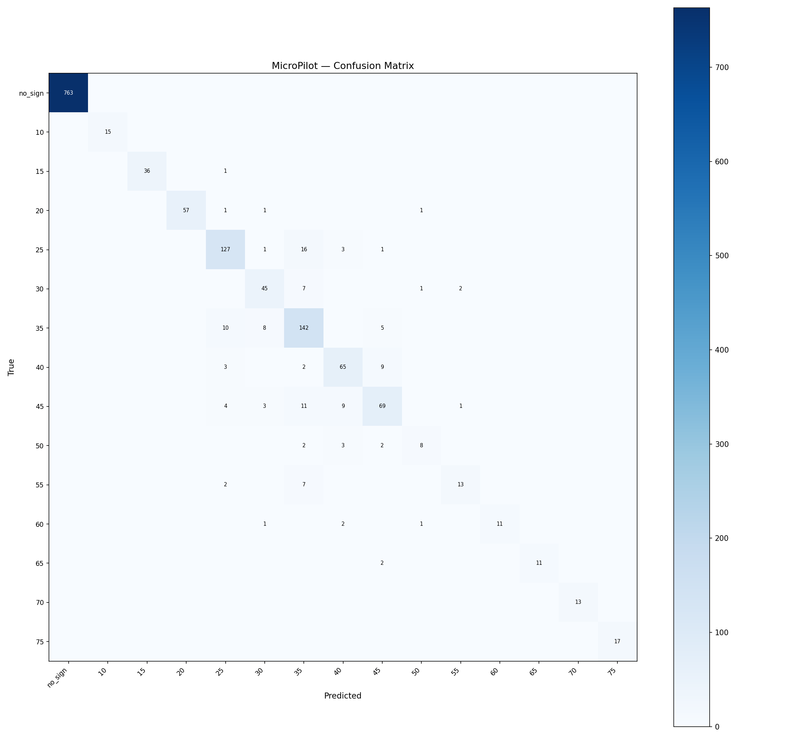

# MicroPilot Evaluation — lora_v2

**Tag:** `lora_v2`  
**LoRA adapter:** `models/minimind-o-lora-v2`  
**Eval samples:** 1514 / 7573 total (held-out 20%, seed=42)  

## Summary

| Metric | Value |
|---|---|
| Accuracy | 0.919 (1392/1514) |
| Macro F1 | 0.869 |
| Weighted F1 | 0.919 |

## Per-Class Metrics

| Class | Precision | Recall | F1 | Support |
|---|---|---|---|---|
| no_sign | 1.000 | 1.000 | 1.000 | 763 |
| speed_limit_10 | 1.000 | 1.000 | 1.000 | 15 |
| speed_limit_15 | 1.000 | 0.973 | 0.986 | 37 |
| speed_limit_20 | 1.000 | 0.950 | 0.974 | 60 |
| speed_limit_25 | 0.858 | 0.858 | 0.858 | 148 |
| speed_limit_30 | 0.763 | 0.818 | 0.789 | 55 |
| speed_limit_35 | 0.759 | 0.861 | 0.807 | 165 |
| speed_limit_40 | 0.793 | 0.823 | 0.807 | 79 |
| speed_limit_45 | 0.784 | 0.711 | 0.746 | 97 |
| speed_limit_50 | 0.727 | 0.533 | 0.615 | 15 |
| speed_limit_55 | 0.812 | 0.591 | 0.684 | 22 |
| speed_limit_60 | 1.000 | 0.733 | 0.846 | 15 |
| speed_limit_65 | 1.000 | 0.846 | 0.917 | 13 |
| speed_limit_70 | 1.000 | 1.000 | 1.000 | 13 |
| speed_limit_75 | 1.000 | 1.000 | 1.000 | 17 |

